# Team Name - Game Name

Unity Group 9 - Gizemli İkizler: Zindanın Yankıları

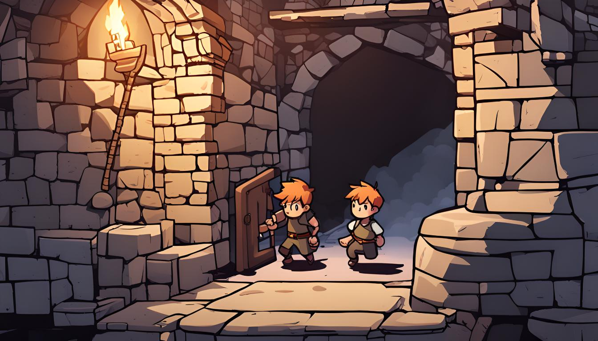

# Team Members
| Name | Role | Social Media |
| --- | --- | --- |
| Bekir Evrim Sümer | Scrum Master - Developer | |
| Beyzanur Kahraman | Product Owner - Game Artist |  |
| Bahadır Işık | Developer |  |
| Çağla Gök | Developer |  |
| Barış Berişbek | Developer |  |

# Game Description
### Story
Once upon a time, there were twin brothers named Alex and Riley. They were well-behaved and responsible children; they did their homework and asked their mother for permission to play video games. Their favorite game was Smash Dungeon. This game, a classic dungeon exploration game, had become their favorite.

But our story doesn't start here. No, the real story starts right here! Come, come a little closer. But not too much... Because the twin brothers fell into this trap.

One day, while playing Smash Dungeon again, a fight broke out between the brothers. The brothers, as the name suggests, were constantly bickering. This time the fight was quite intense and Alex, angry, threw the gamepad at Riley's head. Riley was about to go to his mother to complain when unexpected letters and symbols appeared on the TV.

The twin brothers curiously entered the bottom of the television and tried to decipher the meanings of these letters and symbols. However, they got too close. SUDDENLY, TWO SATANIC ARMS PULLED THEM INTO THEIR FAVORITE GAME.

The twin brothers, trapped inside Dungeon, will try to complete the dungeon by supporting each other and using their intelligence. They will encounter new challenges at every step, but by working together and using their mirrors skillfully, they will be able to escape from this magical world. Good luck, twin brothers!

## Game Information

- **Game Type:** Puzzle, Adventure
- **Platform:** PC
- **Game Engine:** Unity
- **Art Style:** 3D
- **Target Audience:** This game can appeal to male and female players across a wide age range (10-35 years). Combining elements of adventure, exploration, action and strategy, the game will be especially appealing to players who are interested in these types of games. 

## Game Features

- **Feature 1:** Mirror Placement: Players try to direct the light to the target point by placing mirrors at certain points.

- **Feature 2:** Light Beam: To pass the level, the light beam must be reflected in the right direction.

- **Feature 3:** When the light beams reach their targets, the environment changes.

- **Feature 4:** Multiplayer: Players can solve more complex puzzles by collaborating.

- **Feature 5:** Character Control: Control the basic mechanics of the character (movement, jumping, climbing, carrying and placing mirrors).

- **Feature 6:** Cinemachine and Cinemachine Zones: Camera follows the player and changes the view according to the player's position.

## Documentation

- Task Board: [Trello Board](https://trello.com/b/bGnhI7gn/agile-board-template-trello)
- Miro Board: [Miro Board](https://miro.com/app/board/uXjVKyj05nw=/?share_link_id=266004089956)
- Itch.io Page: [Itch.io](https://evrimsumerr.itch.io/cryptic-twins-echoes-of-the-dungeon)

# Sprints
Sprints will be 2 weeks long. At the end of each sprint, a sprint review will be held to evaluate the work done during the sprint and a refirement meeting will be held for the next sprint. Task scoring in sprints will be done with Fibonacci numbers (from 1 to 8).

Story Points:
- 1 - Very Easy
- 2 - Easy
- 3 - Medium
- 5 - Hard
- 8 - Very Hard

When estimating the time for each task, care should be taken to make these times realistic. Tasks are determined before the sprint starts and worked on these tasks during the sprint. New tasks created while the sprint is in progress should be opened in the backlog. If the developers finish their tasks, new task assignments are made from the backlog.

## Summary

Sprint 1

- Theme and story were determined.
- Software and hardware tools to be used were decided.
- User Stories were determined, and a backlog was created.
- Generic classes and functions for development were created.
- Basic character movements were implemented.
- Light Beam and Mirror Placement features were implemented.
- Multiplayer feature was implemented.
- Cinemachine and Cinemachine Zones were integrated.

Sprint 2

- Main menu design was completed.
- Game scene design was completed, and props were added.
- New mechanics to diversify the game were developed.
- Section level system was written.
- UI assets were determined, and panels were designed.
- Music and sound effects were determined and added for testing.
- The storyboard of the game was created, and the story of the characters was written.
- A cinematic was added to the beginning of the game to support the story.
- Character mechanics were tested in the game scene.
- Puzzles were designed and tested in the game scene.
- Dialog system was created.

Sprint 3

- Puzzle design was completed, and in-game tests were conducted.
- UI was developed.
- Settings panel and in-game menu were designed.
- In-game sound effects and music were completed.
- New mechanics to diversify gameplay were added.
- A cinematic video telling the story of the game was created.
- Artificial intelligence was used for cinematic images.
- Unity Analytics integration was done to track player progression and duration.
- NPC dialog system was created.
- NPC walking animations and dialogues were implemented.
- NavMesh was used for NPC walking.
- The game was tested, and bugs were fixed.

## Sprint 1
- **Start Date:** 24.06.2024
- **End Date:** 07.07.2024
- **Expected Story Points:** 73
- **Completed Story Points:** 68

### Sprint Goal
- Theme and story of the game will be determined.
- The software and hardware tools to be used in the development of the  game will be determined.
- User Stories will be determined and a backlog will be created.
- Generic classes and functions that the developer will use while developing the game will be created. (EventManager, UIManager, ExtensionMethods, etc.)
- Basic character movements will be implemented.
- Light Beam and Mirror Placement features will be implemented.
- Multiplayer feature will be implemented.
- Cinemachine and Cinemachine Zones will be implemented.

### Daily Scrum Meetings
  
We were not doing daily scrum at the beginning of the sprint and everyone was doing their own work. Therefore, our communication with each other decreased and it became difficult to follow who was doing what. Since some of our teammates had different tasks to focus on, we could not determine the voice meeting time and decided to do the daily scrum in writing via discord from June 27, 2024.

  

  
<h4 style="display: inline; margin: 0; padding: 0;">Screenshot</h4>

  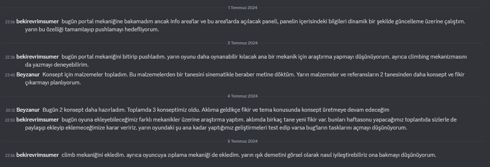

### Sprint Review
  <ul>
    <li>Worked on the theme. Multiple themes were considered and a decision was made together at the meeting.</li>
    <li>As a result of the discussions, it was decided to use Photon Unity Networking (PUN) for multiplayer and integrated into the game. Camera movements and animations were made using DOTween and Cinemachine.</li>
    <li>Basic character movements were implemented. The character can move, jump, and climb.</li>
    <li>New features that can be added to Light Beam were considered and the ideas presented were noted.</li>
    <li>The player's camera perspective was written as top-down, but it was decided that the third-person camera angle should also be tried.</li>
  </ul>

    
<h4 style="display: inline; margin: 0; padding: 0;">Screenshot</h4>

    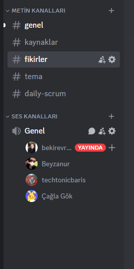

### Sprint Retrospective
#### What went well?
- The team was able to complete the sprint tasks on time.
- The team was able to decide on the theme and story of the game.
- The team was able to decide on the software and hardware tools to be used in the development of the game.

#### What didn't go well?
- The team realized that there were deficiencies in communication and collaboration in the first sprint. It was decided to communicate and collaborate more in the next sprint to eliminate these deficiencies.

#### What could be improved?
- The team decided to work more on the game's features in the next sprint.

### Sprint Backlog Creation Process and Writing Tasks

    
<h4 style="display: inline; margin: 0; padding: 0;">Trello Board</h4>

    
Tasks were created on the Trello board and assigned to the team members. The tasks were created by the Product Owner and the Scrum Master. The categories of the tasks created with the created tags (User Story, Feature, Bug) and the tracking of the story points were provided. 

    
The board consists of 4 main sections:

    <ul>
        <li>Backlog: Lists the tasks to be done in the sprints.</li>
        <li>Sprint: Lists the tasks to be done in the sprint.</li>
        <li>Feature Review / QA: The tasks done in the sprint are tested and reviewed.</li>
        <li>Done: The tasks done in the sprint are marked as completed.</li>
    </ul>
    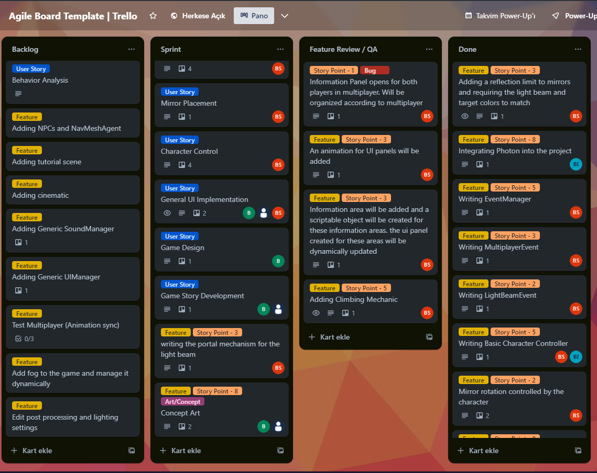

    
<h4 style="display: inline; margin: 0; padding: 0;">Task Details</h4>

    
 After the tasks were created, the scrum master made detailed explanations and added the necessary information. In the task details, information such as which user story the task is related to, who the task is done by, and how many story points the task has were included.

    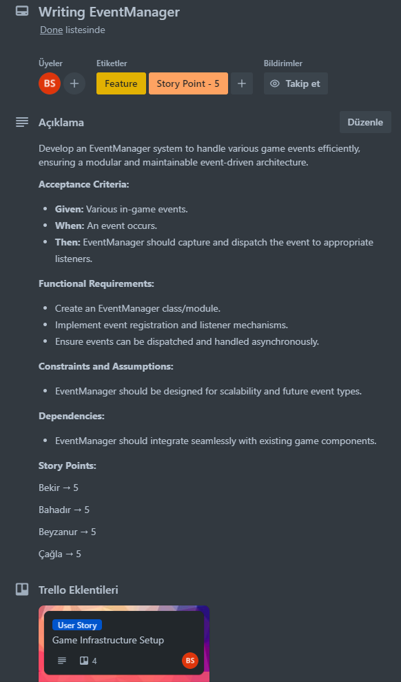

### Game Screenshots

    
<h4 style="display: inline; margin: 0; padding: 0;">Scene</h4>

    
No scene design was done in the first sprint. However, a scene was created where the character's movements and basic mechanics were implemented.

    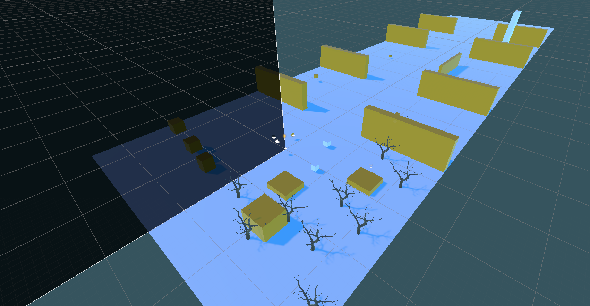

    
<h4 style="display: inline; margin: 0; padding: 0;">In Game</h4>

    
Basic character movements were implemented. The character can move, jump, and climb. Also, multiplayer was tested in this scene. It was checked whether the movements were synchronized.

    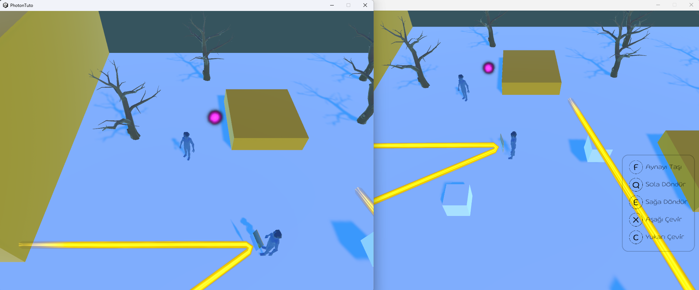
    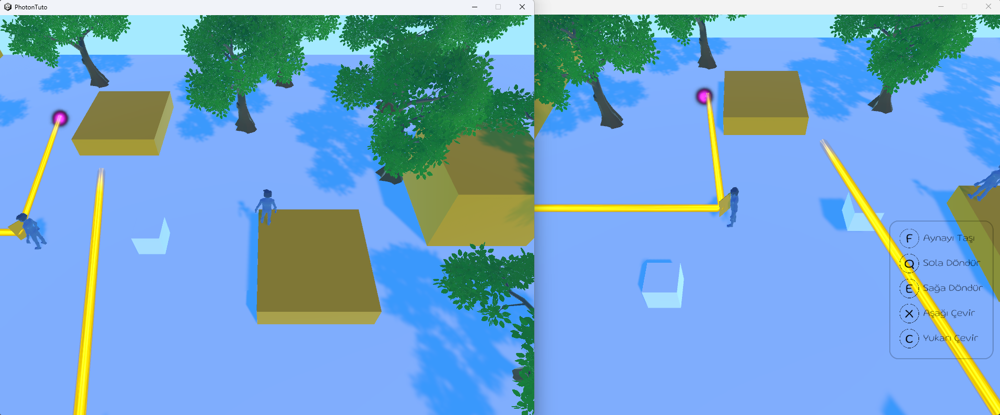

## Sprint 2

- **Start Date:** 08.07.2024
- **End Date:** 21.07.2024
- **Expected Story Points:** 72
- **Completed Story Points:** 63

### Sprint Goal

- Main menu design will be made.
- Game scene design will be made and props will be added.
- New mechanics will be developed to diversify the game.
- Section level system will be written.
- UI asset will be determined for the game and panels will be designed.
- Music and sound effects will be determined and added to the game for testing. A generic SoundManager will be written.
- The storyboard of the game will be created and the story of the characters will be written.
- A cinematic will be added to the beginning of the game to support the story.
- Character mechanics will be tested in the game scene.
- Puzzles will be designed and tested in the game scene.
- Dialog system will be created.

### Daily Scrum Meetings
  
As in the last sprint, we did the daily scrums in a written way on discord. Everyone informed the whole team about which stage they were in and whether they had a problem with the work they did. We had one-on-one meetings where necessary. We tried to have a meeting with the whole team twice a week.

  

  
<h4 style="display: inline; margin: 0; padding: 0;">Screenshot</h4>

  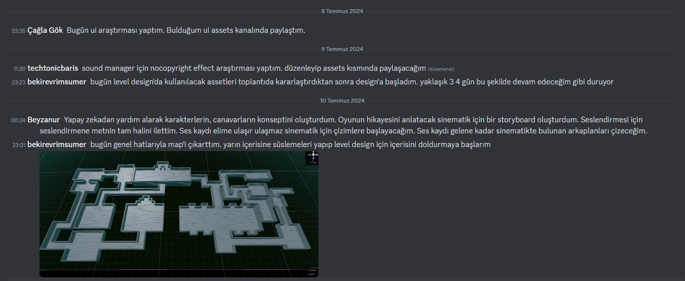
  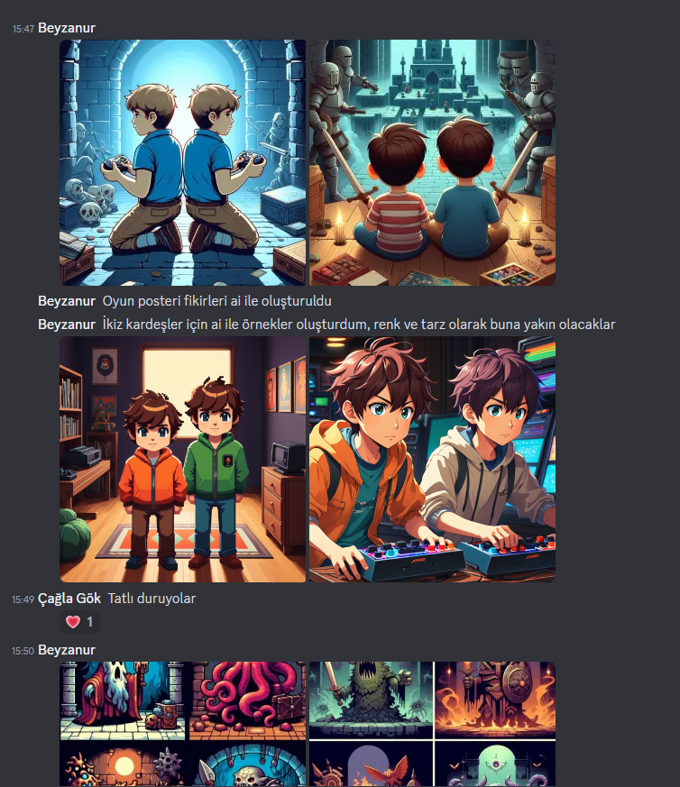

### Sprint Review
  <ul>
    <li>Worked on the main menu design. The main menu was designed and the necessary buttons were added.</li>
    <li>Game scene design was made and props were added. The scene was designed according to the story of the game.</li>
    <li>New mechanics were developed to diversify the game. The mechanics were tested in the game scene. However, not all mechanics planned to be added at the beginning of the sprint were completed in this sprint. It will continue in the next sprint.</li>
    <li>Section level system was written. The system was tested in the game scene.</li>
    <li>UI asset was determined for the game and panels were designed. The panels were added to the game scene.</li>
    <li>Music and sound effects were determined and added to the game for testing. A generic SoundManager was written.</li>
    <li>The storyboard of the game was created and the story of the characters was written. A cinematic was added to the beginning of the game to support the story.</li>
    <li>Character mechanics were tested in the game scene.</li>
    <li>Thoughts were given on the puzzles to be added. We discussed how we would create a level system and shared our ideas.</li>
  </ul>

### Sprint Retrospective

#### What went well?

- The team was able to complete most of the sprint tasks on time.
- The basic structure of the game was created and the main menu and game scene were designed.
- The team was understanding and helpful to each other.

#### What didn't go well?

- As in the first sprint, there were deficiencies in communication and collaboration among team members. We had difficulty in having meetings as a team and decided to increase one-on-one meetings as a solution to this situation.
- More tasks could have been completed to achieve the sprint goals without any deficiencies.

#### What could be improved?

- Level design and puzzle design should be completed as soon as possible and sound effects should be added.

### Sprint Backlog

    
<h4 style="display: inline; margin: 0; padding: 0;">Burndown Chart</h4>

    
Burndown chart is a graphical representation of work left to do versus time. The outstanding work (or backlog) is often on the vertical axis, with time along the horizontal. That is, it is a run chart of outstanding work. It is useful for predicting when all of the work will be completed.

    
This burndown chart consists of 2 lines:

    <ul>
        <li>Baseline, shows the planned amount of work at the beginning of the sprint. This line assumes that the work will be completed at an ideal speed (usually at a constant speed) and shows the completion of the planned work over time.</li>
        <li>Remaining Effort, shows the amount of work done. This line is updated by the team every day and tracks the remaining amount of work over time. This way, it can be understood whether the project will be completed on time.</li>
    </ul>
    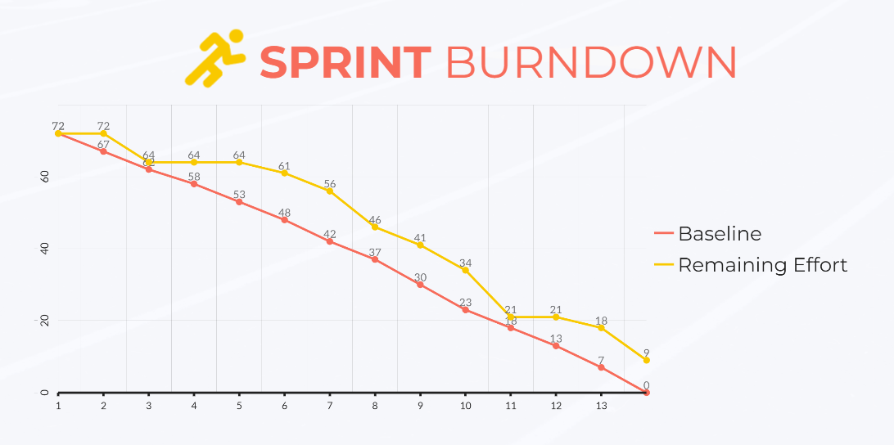

    
<h4 style="display: inline; margin: 0; padding: 0;">Trello Board</h4>

    
In this sprint, tasks were created and tracked on the Trello board. Art/Concept tag was added to filter the tasks opened on the design side. In addition, Sprint-1, Sprint-2, Sprint-3 tags were added to track which sprint the tasks were done in. In the first sprint, while determining the story points, everyone's points were written in the task detail. However, with the decision we took as a team, we removed this and added it as a tag.

    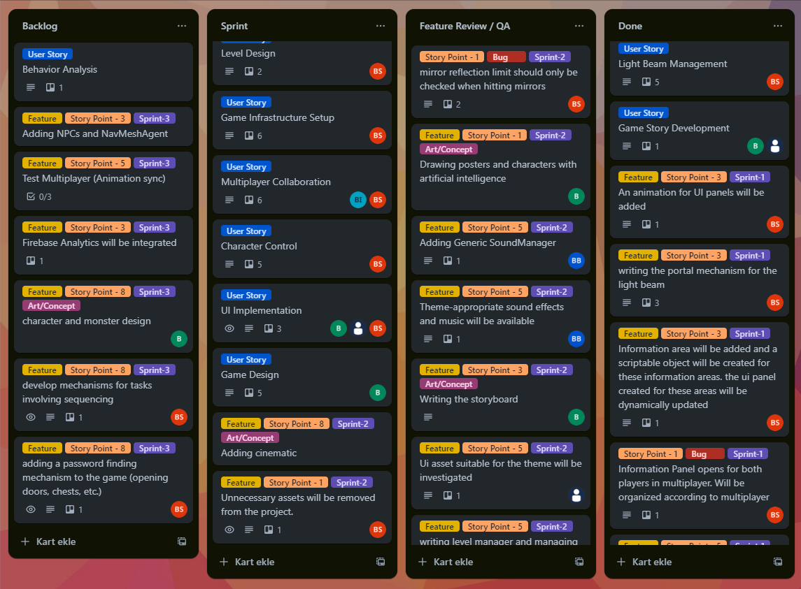

    
<h4 style="display: inline; margin: 0; padding: 0;">Task Details</h4>

    
In the task details, in accordance with scrum, information about which user story the task belongs to, who did the task, and how many story points the task is included. We also continued to write the explanations of the tasks.

    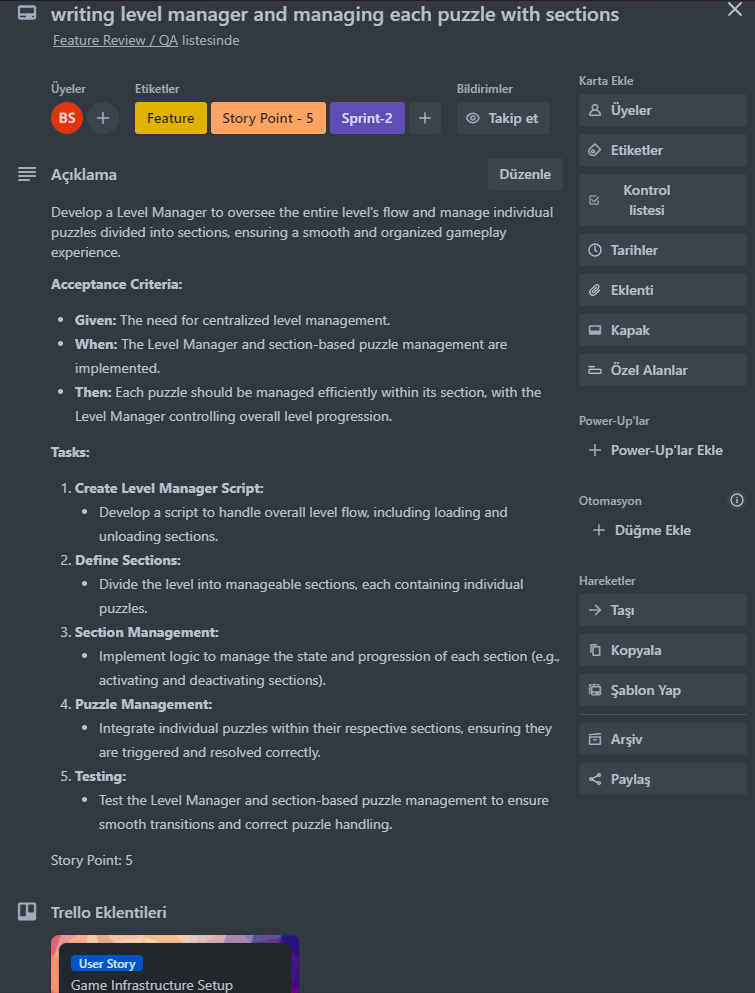

### Game Screenshots

    
<h4 style="display: inline; margin: 0; padding: 0;">Main Menu</h4>

    
The main menu was designed and the necessary buttons were added. The main menu was designed according to the theme of the game.

    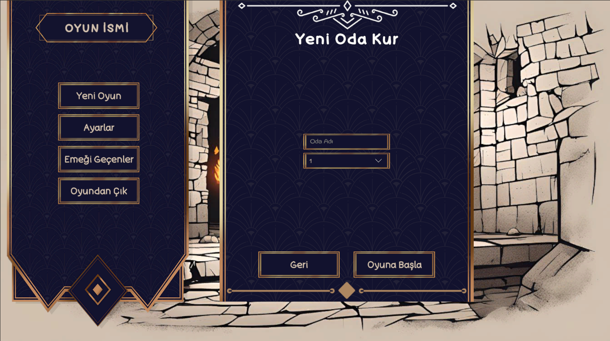

    
<h4 style="display: inline; margin: 0; padding: 0;">Level Design</h4>

    
Game Level Design was made. The level design was designed according to the story of the game. Multiplayer tests were also done.

    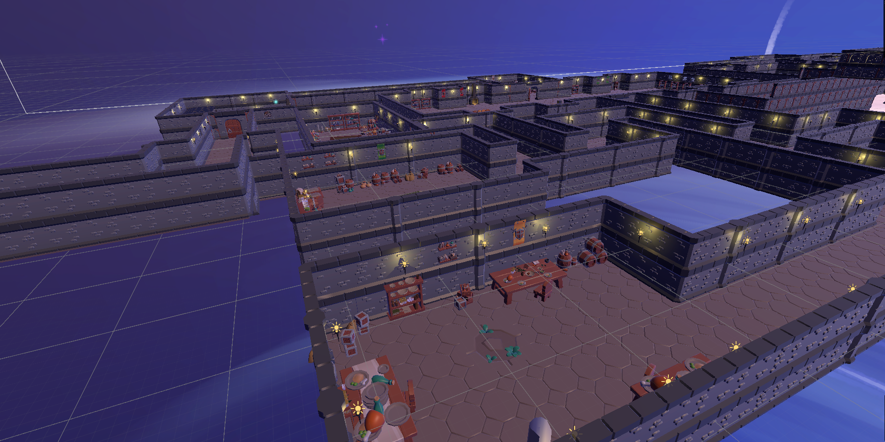

    
<h4 style="display: inline; margin: 0; padding: 0;">Game Scene</h4>

    
The game scene was designed and props were added.

    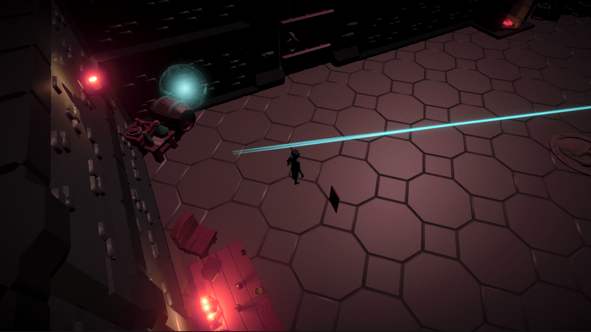

    
<h4 style="display: inline; margin: 0; padding: 0;">Character Mechanics</h4>

    
Character mechanics were tested in the game scene.

    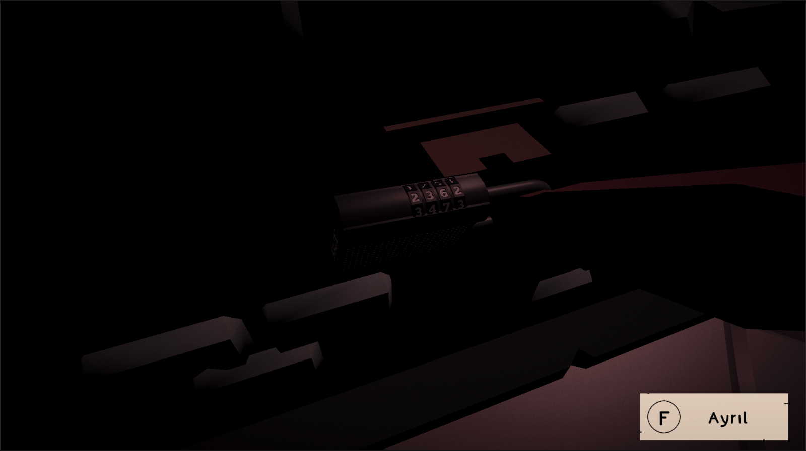

## Sprint 3

- **Start Date:** 22.07.2024
- **End Date:** 02.08.2024
- **Expected Story Points:** 68
- **Completed Story Points:** 68

### Sprint Goal

- Puzzle design will be completed and in-game tests will be completed.
- UI will be developed. Settings panel and in-game menu will be designed.
- In-game sound effects and music will be completed.
- New mechanics that will diversify the gameplay will be added.
- A cinematic video that tells the story of the game will be created. Artificial intelligence will be used for cinematic images.
- Unity Analytics integration will be done to track which section the players followed and how long they followed it.
- NPC dialog system will be created. NPCs' walking animations and dialogues will be made. NavMesh will be used for walking.
- The game will be tested and bugs will be fixed.

### Daily Scrum Meetings
  
As in other sprints, we did daily scrums in writing via discord in this sprint. We reviewed the work done together with short meetings when necessary and helped each other. We tried to communicate and collaborate more in this sprint.

  

  
<h4 style="display: inline; margin: 0; padding: 0;">Screenshot</h4>

  

### Sprint Review
  <ul>
    <li>Puzzle design was completed and in-game tests were completed. The puzzles were designed according to the story of the game.</li>
    <li>UI design in the main menu has been improved. Menu design was also made in the game. A menu where the player can learn key combinations has been added.</li>
    <li>In-game sound effects and music were completed. The sound effects and music were added to the game for testing.</li>
    <li>New mechanics that will diversify the gameplay were added. The mechanics were tested in the game scene.</li>
    <li>A cinematic video that tells the story of the game was created. Artificial intelligence was used for cinematic images.</li>
    <li>Unity Analytics integration was done to track which section the players followed and how long they followed it.</li>
    <li>NPC dialog system was created. NPCs' walking animations and dialogues were made. NavMesh was used for walking.</li>
    <li>We used Cinemachine collider to overcome obstacles between the character and the camera.</li>
    <li>Errors in the dialog system and mirror placement were fixed.</li>
    <li>Dialogs were developed to help the player. Information message areas were added for players.</li>
    <li>The game was tested and bugs were fixed.</li>
  </ul>

### Sprint Retrospective

#### What went well?

- All tasks planned for this week were completed without any deficiencies.
- The team was able to complete the sprint tasks on time.
- The game was tested in detail. Existing and potential errors were fixed.

#### What didn't go well?

- Some tasks were difficult to complete. Extra time was spent to complete these tasks.

#### What could be improved?

- A decision was made that the team should work much more focused and take ownership of the work. The whole team should contribute one hundred percent and take ownership.

### Sprint Backlog

    
<h4 style="display: inline; margin: 0; padding: 0;">Burndown Chart</h4>

    
We reached our sprint goals by working more in the last days of the sprint by looking at the burndown chart in this sprint. All the work planned at the beginning of the sprint was completed.

    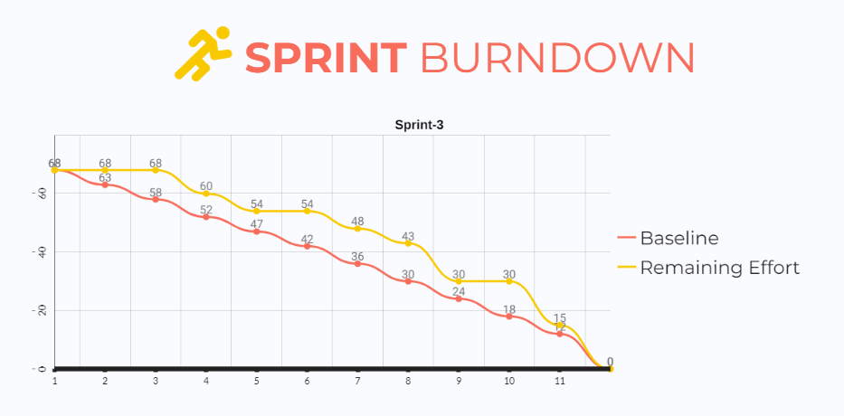

    
<h4 style="display: inline; margin: 0; padding: 0;">Trello Board</h4>

    
All tasks waiting in the backlog were assigned and moved to the sprint tab. Extra information was added to the tasks to be detailed and explanatory.

    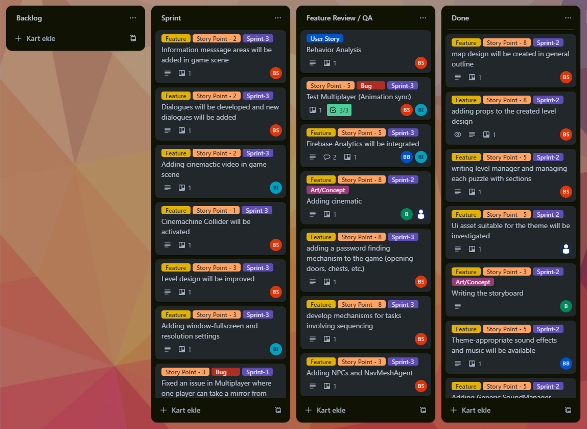
    
Creating user stories in Trello and matching them with tasks allowed us to see how many tasks we need to open for each user story in all sprints, how many story points of work we did.

    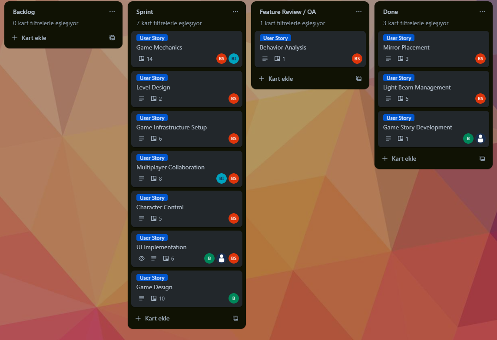

    
<h4 style="display: inline; margin: 0; padding: 0;">Task Details</h4>

    
In this sprint, at the request of the team members, we proceeded with shorter task explanations. It was observed that there were more bug tasks than other sprints.
 
    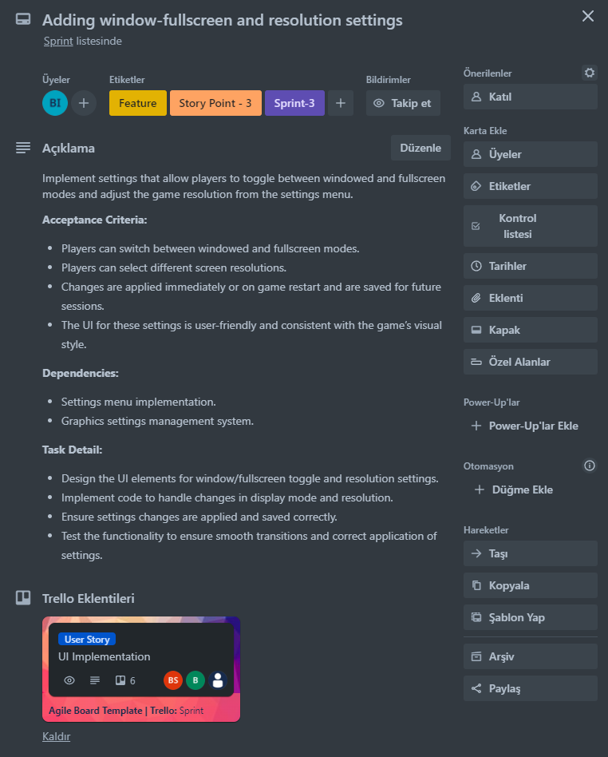

### Game Screenshots

    
<h4 style="display: inline; margin: 0; padding: 0;">Unity Analytics</h4>

    
Unity Analytics integration was done to track which section the players followed and how long they followed it.

    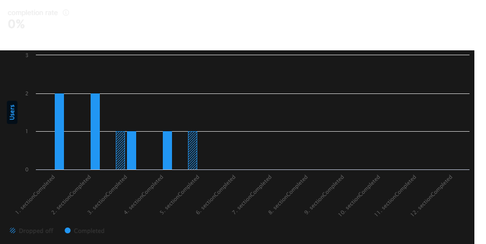
    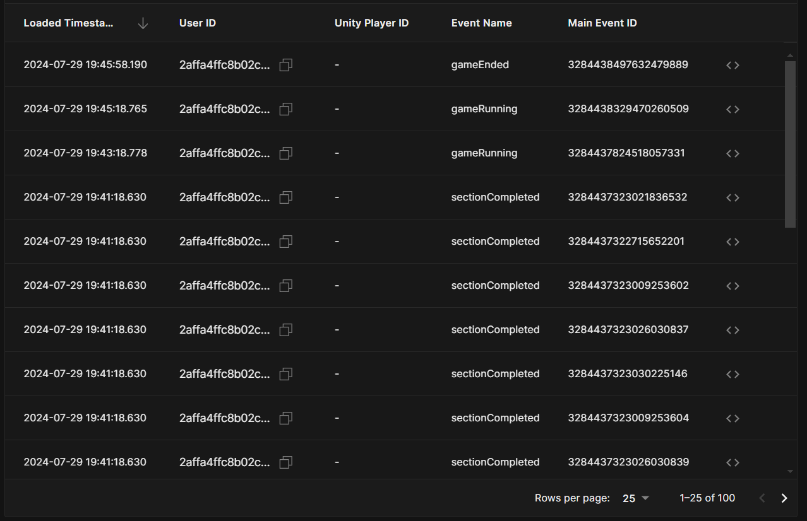
    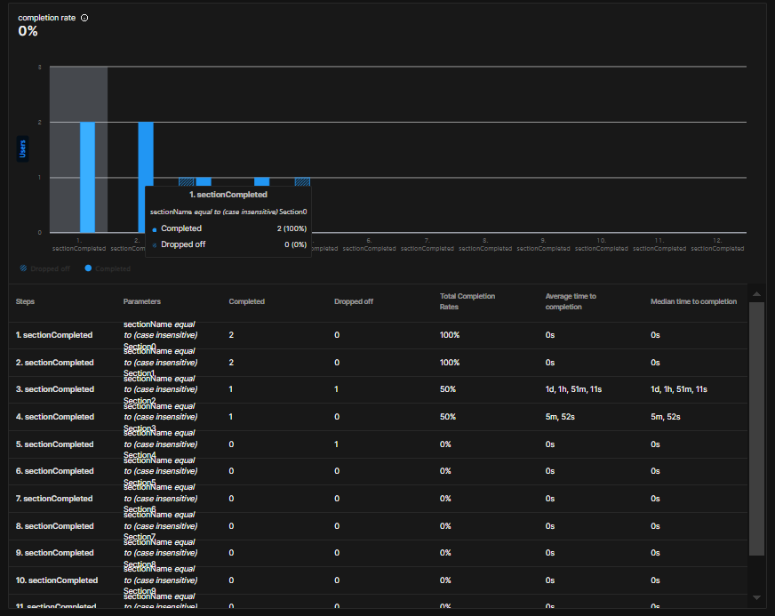

    
<h4 style="display: inline; margin: 0; padding: 0;">Puzzle Design</h4>

    
Puzzle design was completed and in-game tests were completed. The puzzles were designed according to the story of the game.

    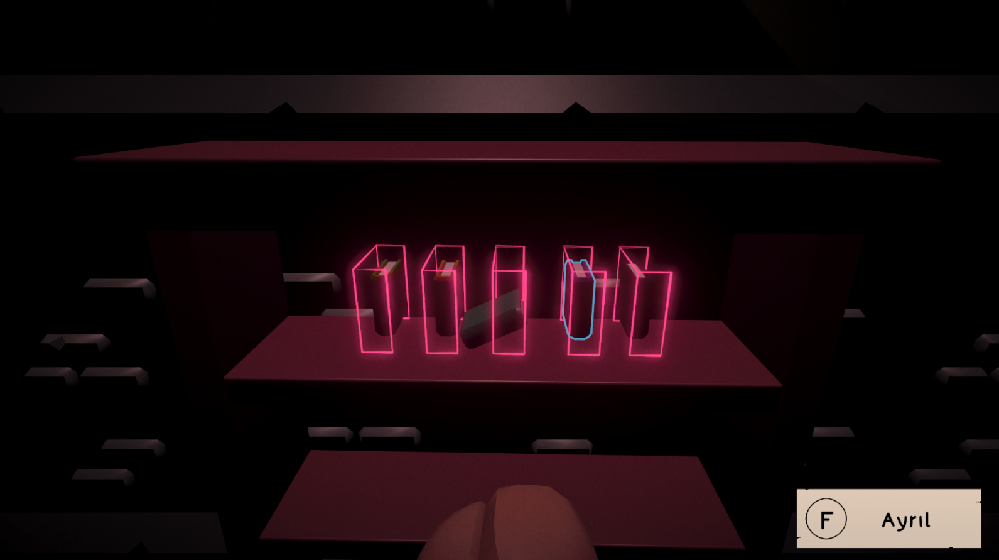

    
<h4 style="display: inline; margin: 0; padding: 0;">UI Design</h4>

    
UI design in the main menu has been improved. Menu design was also made in the game. A menu where the player can learn key combinations has been added.

    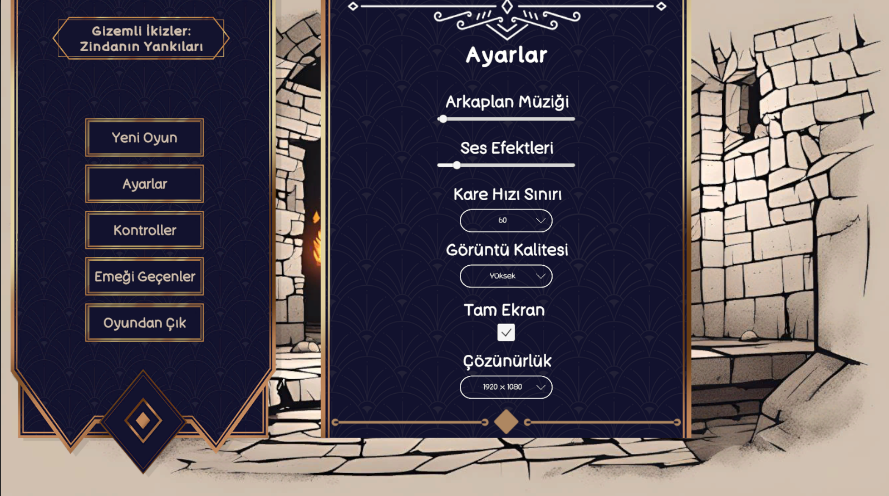

    
<h4 style="display: inline; margin: 0; padding: 0;">In Game</h4>

    
Errors in the dialog system and mirror placement were fixed. Dialogs were developed to help the player. Information message areas were added for players.

    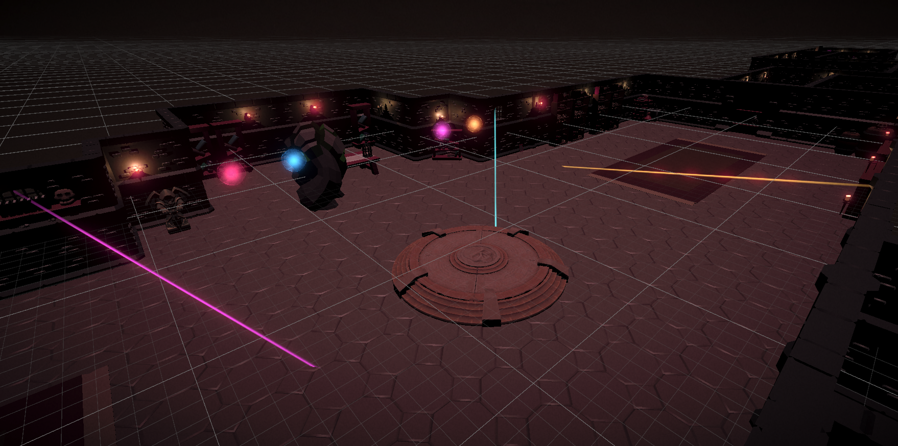
    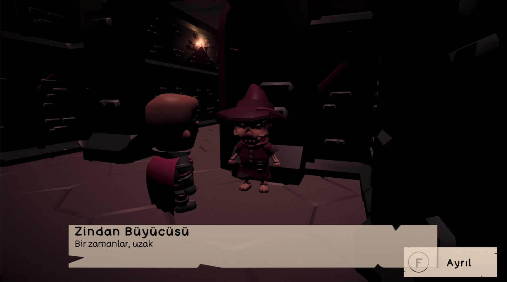
    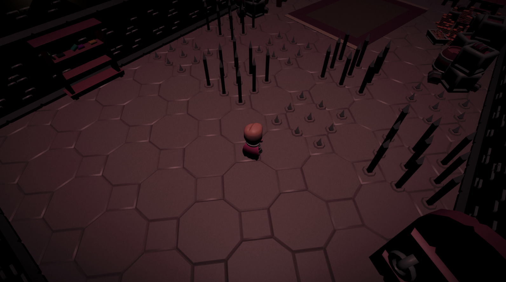

